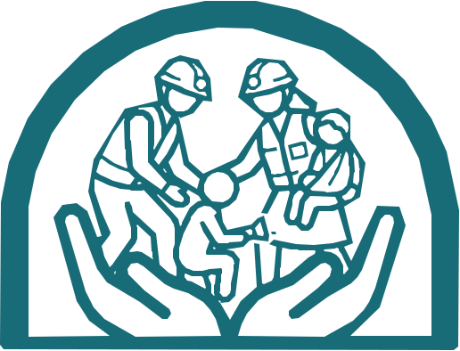

<div align="center">



# Kuna Ayuda

**A disaster-relief resource network for your community — earthquakes and wildfires first.**

Kotlin Multiplatform (Android · iOS · Desktop) + a Ktor backend. Multi-country: 🇨🇴 🇮🇩 🇪🇸 🇮🇹

[](LICENSE)

**🌐 [Live site](https://kuna-ayuda-def81359e2e0.herokuapp.com/)** · **⬇️ [Download the desktop app](https://github.com/jyodroid/kuna-ayuda/releases/latest)** · [Privacy](https://kuna-ayuda-def81359e2e0.herokuapp.com/privacy) · [Terms](https://kuna-ayuda-def81359e2e0.herokuapp.com/terms)

</div>

> ⚠️ **Kuna Ayuda is not an emergency service.** In an emergency, always call your country's official
> numbers (123 in Colombia, 112 in Spain/Italy/Indonesia). Community content is unverified — verify
> before acting.

---

## What it is

Kuna Ayuda brings together, in one place, what's useful during a disaster:

- **Live earthquake feed**, prioritized by the affected regions, with aftershocks (réplicas).
- **Active wildfire feed** (second hazard), ranked toward populated areas.
- **Official help points** on a map — verified shelters and collection centers.
- **Mutual-aid network** — request or offer resources between neighbors (moderated; AI paste-and-classify).
- **Lost & Found** — reunification reports for people and pets, with photos.
- **Geolocated SOS** — call for help with your location or check in as safe. Works offline (retry queue).
- **Offline guide** — official emergency numbers + safety tips, available without internet.

Localized **ES (default) / EN / Bahasa Indonesia / Italian** (device-locale driven).

## Architecture

**Layer-first**, deliberately. The backbone is the `core:*` layer modules; **feature UI lives in
`composeApp`** as `ui/*` packages. A module is created only when platform code or reuse demands it.

```
composeApp ──────────────► core:domain   (models, use-cases, Geo — pure Kotlin, no deps)
  (ui/*, DI, navigation)   core:data     (Ktor client, DTOs+mappers, settings, offline outbox)
  depends on all core:*    core:location (expect/actual device location)
  + feature:map            core:media    (expect/actual image capture)
                           core:presentation / core:designsystem (scaffolding)
feature:map ─► core:*      (expect/actual MapLibre map, mobile; JVM stop-gap)

server  ── self-contained Ktor (Netty). Owns its own DTOs; does NOT depend on core:*.
           config/ · di/ (Koin) · routes/ (+dto) · services/ · upstream/ · domain/+infrastructure/
           (Exposed + Postgres + Flyway; DB activates only when DATABASE_URL is set)
           Also serves the landing site (landing/ → resources/web) at /.
```

- **Client is thin & offline-friendly**: `core:domain` is pure (fully unit-testable); `core:data`
  wraps one shared Ktor `HttpClient`; SOS persists to an okio outbox and auto-retries.
- **Server owns the country bounding boxes** (`?country=CO|ID|ES|IT` on the feeds); the **client owns
  the per-country region/city lists** (affected-place logic + map centering).
- **Only moderators authenticate** (JWT). Every regular user stays anonymous — no accounts.
- **Data sources**: USGS + SGC (quakes), NASA FIRMS + GDACS (wildfires), GDACS + ReliefWeb (ingested
  disaster feeds). Anthropic (Claude) + Google Fact Check tools power the optional board classify flow,
  behind monthly spend caps.

See [`CLAUDE.md`](CLAUDE.md) for the exhaustive architecture, conventions, and rationale.

## Tech stack

Kotlin Multiplatform · Compose Multiplatform · Koin · Ktor (client + server) · kotlinx.serialization ·
Exposed + PostgreSQL + Flyway · MapLibre · Coil 3 · okio · Vite (landing).

## Getting started

**Prerequisites:** JDK 17, Android Studio (latest), Xcode (for iOS), Node 18+ (for the landing site),
optionally Docker + PostgreSQL (the server runs DB-less and returns empty for moderated data if no DB).

```shell
# Backend (also serves the landing page at http://localhost:8080/)
./gradlew :server:run

# Desktop app
./gradlew :composeApp:run

# Android debug APK
./gradlew :composeApp:assembleDebug

# Landing site (rebuild into the server's resources/web)
./gradlew :server:buildLanding
```

iOS: open `iosApp/iosApp.xcodeproj` in Xcode (the Compose framework is `ComposeApp`; a one-time SPM step
adds MapLibre — see `feature/map/README.md`).

**Local database (optional)** — the server needs Postgres only when `DATABASE_URL_KUNA`/`DB_PASSWORD_KUNA`
is set (Flyway then applies the migrations). See `CLAUDE.md → Local database setup`.

## Testing

```shell
./gradlew :core:domain:jvmTest      # pure domain logic (Geo, aftershocks, prioritization, fire, country data)
./gradlew :core:data:jvmTest        # DTO↔domain mappers, offline SOS outbox
./gradlew :server:test              # UsageLimiter spend caps, FireService ranking (+ Testcontainers where used)
```

Contributions should come with tests — pure logic (`core:domain`, mappers, services) is the priority.

## Contributing

We'd love help — see **[CONTRIBUTING.md](CONTRIBUTING.md)**. Good first areas: translations, new-country
data (regions + official help points + emergency numbers), tests, accessibility, and the desktop map.

## License

[MIT](LICENSE). Data from USGS, SGC, NASA FIRMS, GDACS and ReliefWeb remains under each provider's terms.
